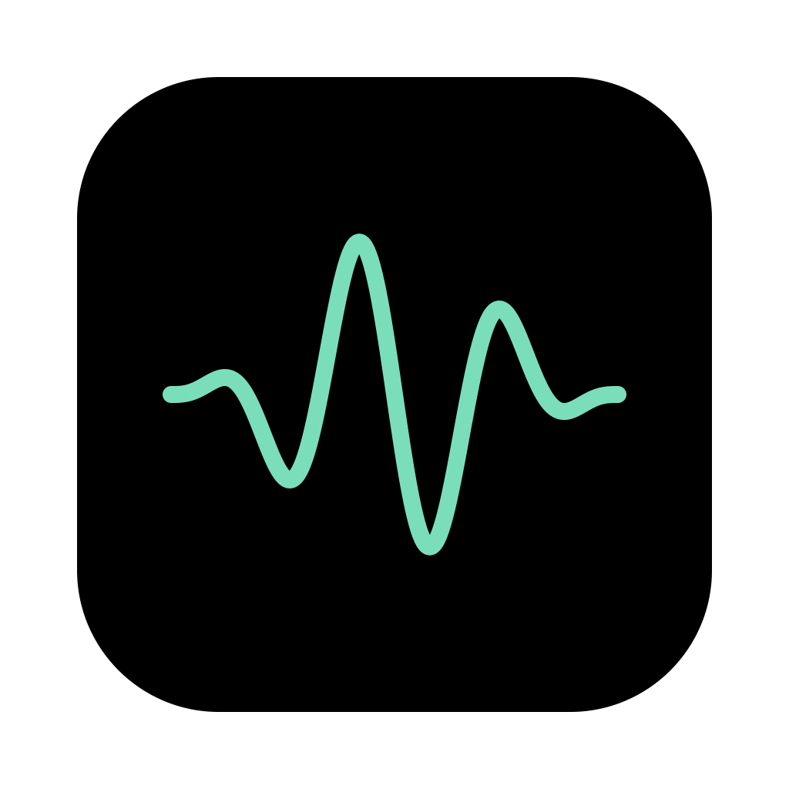
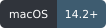
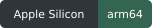
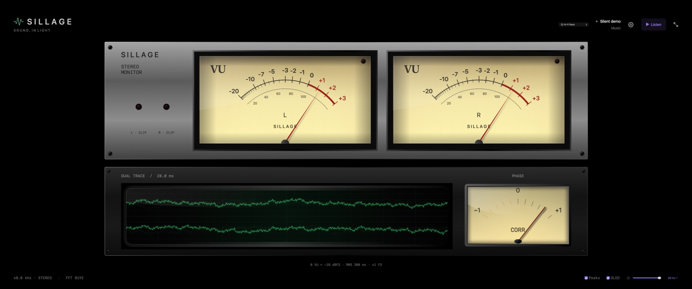
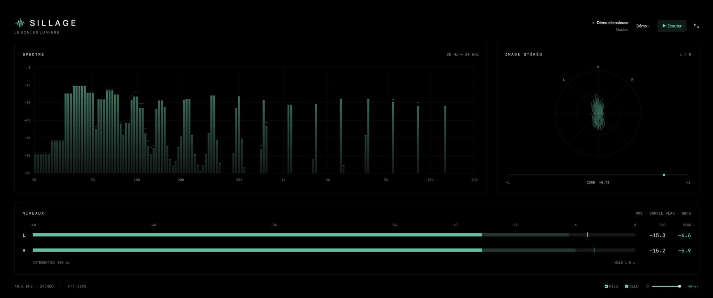
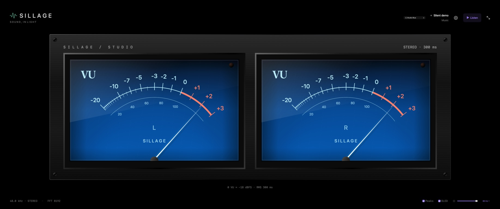

<p align="center">
  
</p>
<h1 align="center">Sillage</h1>
<p align="center"><strong>Sound, in light.</strong><br>A visual companion for your listening sessions.</p>

<p align="center">
  <a href="https://digital-strategy.ec.europa.eu/en/policies/eu-icons-labelling-ai-generated-content"><picture><source media="(prefers-color-scheme: dark)" srcset="docs/assets/eu-ai-generated-white.svg"></picture></a>
  
  
  
</p>

Enjoy the movement of analog needles, the glow of CRT traces, and a closer look at your music's dynamics, frequency balance, and stereo image. **Sillage** is a native macOS audio visualizer built for Apple Silicon, equally at home beside a desktop DAC or full screen in a listening room.

System audio capture keeps your selected output and volume unchanged. Play through your usual app and audio interface; Sillage follows along, with local processing and no virtual audio driver, recordings, or cloud service.



| Dashboard · Thermal theme | Studio Blue · analog VU |
|:---:|:---:|
|  |  |

*Captured in Sillage 0.5.2 using the silent Music demo. [Explore the analog gallery →](docs/ANALOG-VIEWS.md)*

## See what you hear

| Instrument | What it shows |
|---|---|
| **Stereo levels** | Independent L/R RMS and sample peaks, a 1.5-second peak hold, and clipping indicators. |
| **Spectrum** | 20 Hz–20 kHz across 160 logarithmic bands, with an 8192-point FFT, attack/release smoothing, and peak hold. |
| **Stereo image** | A goniometer and −1 to +1 correlation readout to follow channel relationships and mono compatibility. |
| **Analog VU** | Illuminated needles with 300 ms RMS integration and a 0 VU reference of −18 dBFS. |
| **CRT waveform** | Aligned left/right traces with a 20 ms sweep at normal sample rates. |
| **Broadcast PPM** | Quasi-peak meters that respond faster than the VU dials, with separate channel readouts. |

These instruments describe the captured digital stream. LUFS and true peak are planned; the analog views are software emulations. [Measurement details and limits →](docs/ARCHITECTURE.md#instrument-definitions)

## Make it part of your setup

- **11 views:** Dashboard, Meters, Spectrum, Stereo, Analog VU, Studio Blue, Vintage Console, CRT Oscilloscope, CRT Goniometer, Broadcast PPM, and Hi-Fi Rack.
- **9 themes:** frequency gradients and vertical color transitions by level, including Thermal, Neon, and Alpine. Analog materials and CRT phosphors keep their own character.
- **OLED-friendly presentation:** pure black backgrounds, full screen, adjustable brightness, subtle pixel drift, and silence dimming. Choose a 60 or 30 Hz refresh target.
- **A phone beside your system:** pair by QR code on local Wi-Fi and choose its view and theme independently. Audio stays on the Mac. [Phone display guide →](docs/PHONE-DISPLAY.md)
- **English and French**, with silent Music, Mono, Antiphase, Left Only, and Silence previews in **Settings**.

## Get started

Requires **Apple Silicon**, **macOS 14.2+**, and **Swift 6+** to build.

```sh
git clone https://github.com/jorcau/sillage.git
cd sillage
bash scripts/build-app.sh
open dist/Sillage.app
```

Click **Listen** and allow system audio capture when macOS asks. Open **Settings** with the gear or **⌘,**, choose a view from the top bar, and use **⌃⌘F** for full screen.

Sillage is an early prototype, signed locally and not notarized. See [validation and current limitations](VALIDATION.md) before relying on it for measurement work.

## Documentation

- [User guide](docs/USAGE.md) — permissions, settings, demos, and display controls.
- [Architecture and measurements](docs/ARCHITECTURE.md) — capture, analysis, rendering, and planned modules.
- [Development](docs/DEVELOPMENT.md) — builds, tests, and localization.
