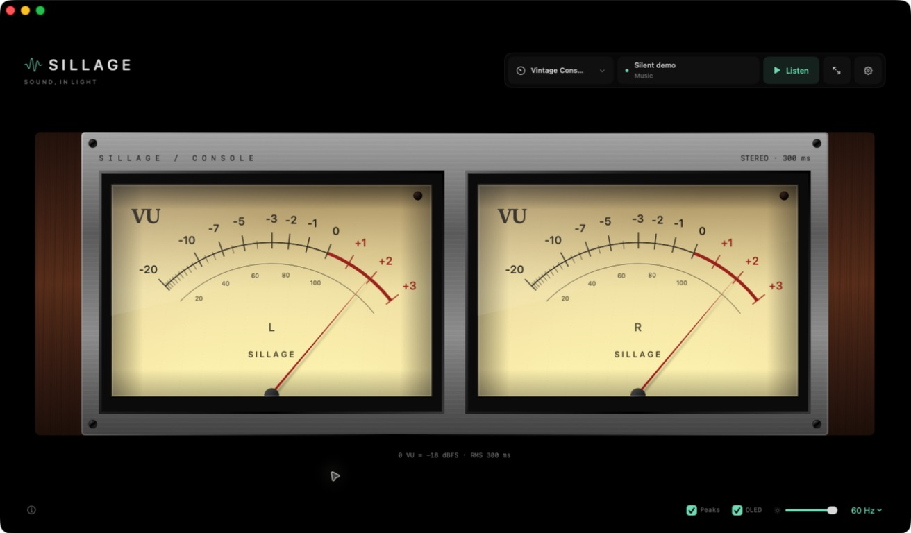
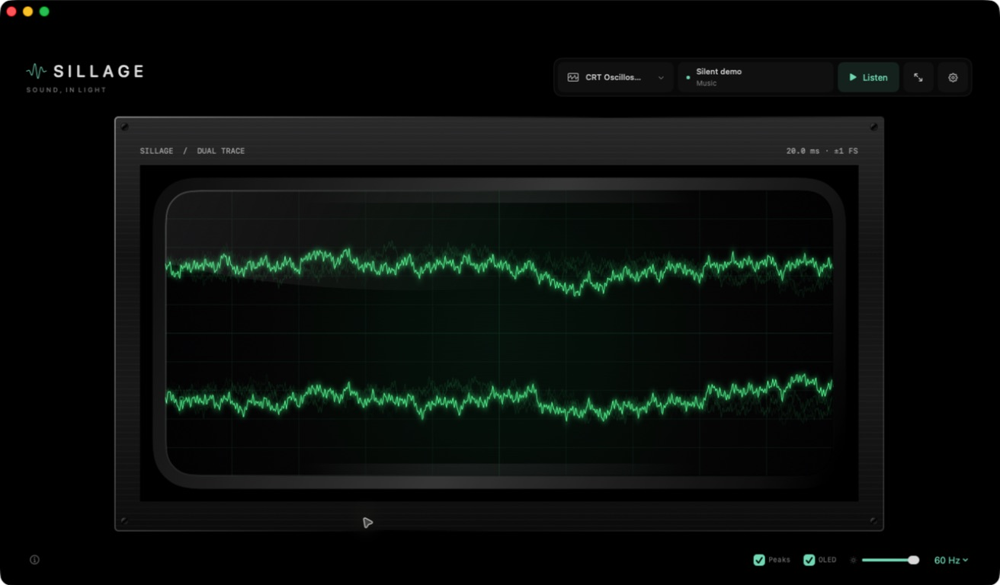
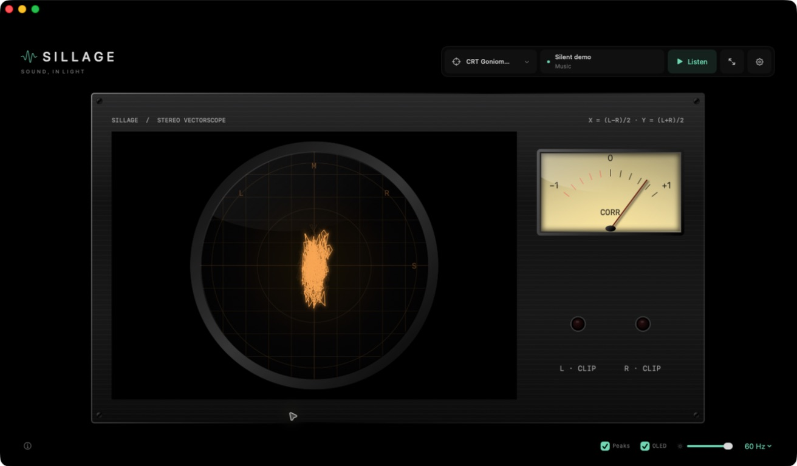
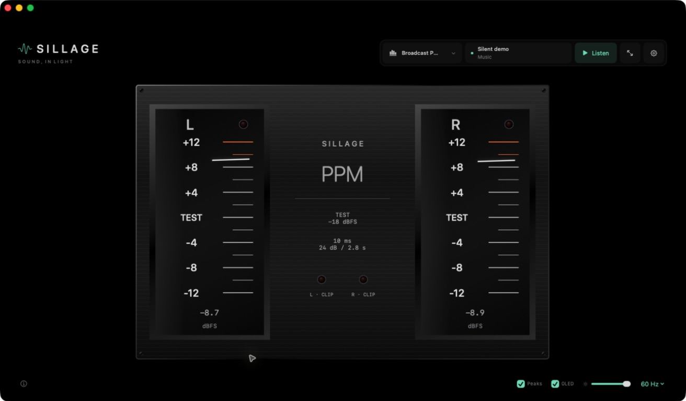

# Analog instrument gallery

Choose a view from the top bar or the macOS **View** menu. Every instrument responds to the same live audio session; switching views keeps capture and analysis running.

Screenshots captured from **Sillage 0.5.2** on September 19, 2026, using the silent **Music** demo. The instruments are rendered by the app; these are not mockups.

## Studio Blue · ⌘6

Blue backlighting, white needles, smoked glass, and a graphite metal cabinet.

## Vintage Console · ⌘7

Warm cream dials, red needles, brushed aluminum, and walnut side panels.

## CRT Oscilloscope · ⌘8

Two green waveform traces, a recessed glass tube, a measurement grid, and short phosphor persistence.

## CRT Goniometer · ⌘9

An amber circular stereo scope with a separate correlation needle and L/R clipping lamps.

## Broadcast PPM · ⌘0

Vertical quasi-peak meters with white pointers, dark glass, and independent channel readouts.

## Hi-Fi Rack · ⌘−

Two stacked units combining stereo VUs, a waveform CRT, correlation, and clipping lamps.

## Reading the instruments

| Instrument | Scale and behavior |
|---|---|
| VU dials | 0 VU = −18 dBFS RMS; 300 ms RMS integration; +3 VU end stop |
| Waveform CRT | Fixed ±1 full-scale amplitude; 20 ms sweep at normal sample rates; L/R remain aligned |
| Stereo CRT | X=(L−R)/2, Y=(L+R)/2; mono is vertical, antiphase is horizontal |
| Correlation dial | −1 for antiphase, 0 for uncorrelated signals or insufficient energy, +1 for mono |
| Broadcast PPM | TEST = −18 dBFS quasi-peak; relative −12 to +12 dB face; absolute dBFS readout below |
| Red lamps | Digital sample clipping with a 2 s indicator hold |

The PPM has approximately 10 ms integration and returns 24 dB in 2.8 s. It responds more quickly than the RMS-based VU dials. Neither emulation claims certified hardware calibration; PPM is not true peak or LUFS. See [architecture and measurements](ARCHITECTURE.md) for the detector, historical reference, and waveform bounds.

Materials and phosphor colors remain consistent across themes. Interface controls still follow the selected theme, while brightness and OLED controls apply to every view. The artwork is rendered at the final display size without enlarging bitmap backgrounds.
