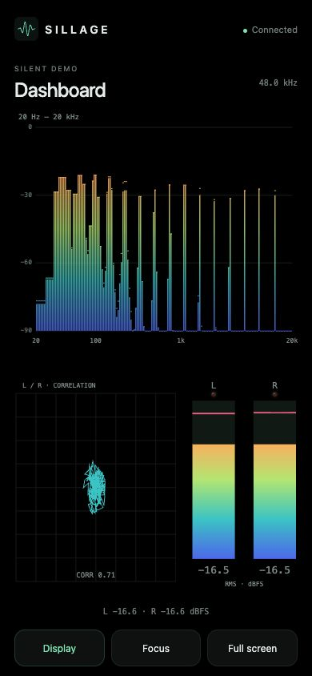

# Phone display

Sillage can display the Mac's instruments in a phone browser on the same local network. The Mac captures and analyzes audio; the phone receives visualization measurements and draws its own screen. Sound continues through the Mac's selected output.

## Connect

1. Keep the Mac and phone on the same Wi-Fi/LAN and keep the Mac awake.
2. In Sillage on the Mac, open **Settings → Phone display** and enable **Share on the local network**.
3. Scan the QR code with the phone's camera, or use **Copy private link** and open that link on the phone.
4. Start **Listen** on the Mac, or use a silent demo in Settings to try the display without playing sound.

If macOS asks for local-network access or an incoming connection, allow Sillage for this local sharing feature. The web page never requests microphone or camera access.

Sharing is off by default. Up to four screens can connect simultaneously. Stopping sharing closes the viewers and invalidates their access. Re-enabling sharing produces a new QR code; scan it again. The private link is a viewing credential, valid until sharing stops.

## Mobile controls

- **Display:** choose among eleven view compositions and nine themes; select English/French, brightness, and a 60/30 Hz render target.
- **Follow the Mac's view and theme:** enabled initially. Choosing a view or theme on the phone turns following off. Other phones and the Mac keep their choices.
- **Focus:** hide the surrounding controls in portrait or landscape. **Show controls** brings them back.
- **Full screen:** available when the browser supports it. Focus remains available on browsers without that API, including some iPhone configurations.

Brightness starts at 100%. Analog materials and CRT phosphor colors stay fixed; themes affect digital instruments. The phone has its own Canvas rendering and responsive compositions, so it is not a video mirror of the Mac window.

Measurements arrive at roughly 30 updates per second; rendering targets 60 or 30 Hz. Actual smoothness depends on the phone, browser, and Wi-Fi. Putting the page in the background disconnects the live feed to reduce work. Returning reconnects automatically while the same sharing session remains active. Stale measurements clear instead of remaining frozen on screen.

## Browser versus installed PWA

The local address uses HTTP and works directly in the browser. A manifest, app icons, and an optional service worker are included, but full PWA installation and service workers require HTTPS or a localhost development origin. A phone opening the Mac's LAN address is not localhost. See [MDN's installation requirements](https://developer.mozilla.org/en-US/docs/Web/Progressive_web_apps/Guides/Making_PWAs_installable).

Use the browser's **Add to Home Screen** option if offered; its behavior varies by browser. This version does not provision certificates or an HTTPS reverse proxy. Offline caching, when available on a secure origin, stores only the public app shell. Live measurements always require the Mac. Screen wake lock is requested only where supported on a secure origin; otherwise the phone's normal auto-lock setting applies.

## Connection help

- Keep both devices on the same LAN; guest Wi-Fi may isolate them. If the Mac has multiple addresses, choose the one on the phone's network in Settings.
- Leave Sillage open and the Mac awake. If its address changes, stop and restart sharing, then scan the new QR code.
- Use the full private link or QR code. Typing only the displayed address opens the pairing instructions, without granting access.
- If all four viewer slots are occupied, close an unused viewer and retry.
- If sharing cannot start, another app may already be using TCP port 8765.
- If the Mac is waiting for system audio capture, the phone cannot resolve that capture issue. A silent demo can verify the display connection independently.

There is no cloud service, remote audio playback, or phone control of Mac capture. Use a trusted local network: the built-in HTTP connection is not encrypted. Internet exposure and television-specific behavior are outside this version's scope.
