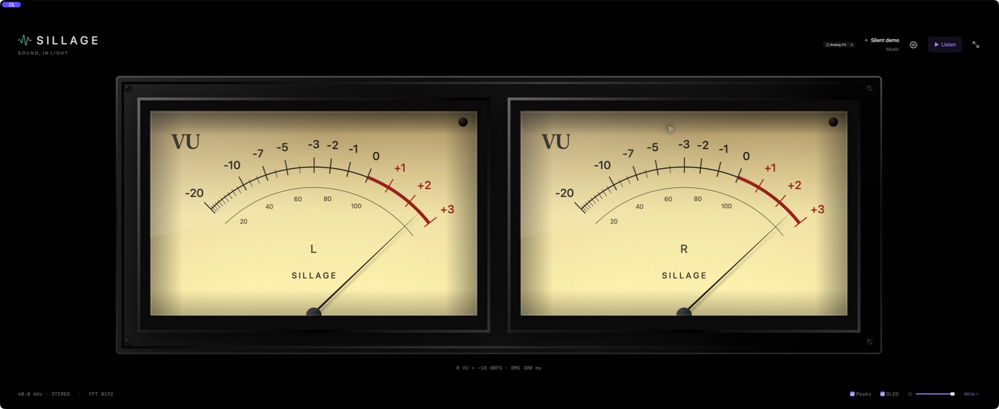

# User guide

## System audio

Open Sillage and click **Listen**. macOS controls system audio capture permission. If capture does not start, check **System Settings → Privacy & Security → Screen & System Audio Recording**; the label varies by macOS version. Allow Sillage, reopen the app, and retry.

Sillage creates a private Core Audio tap. It does not replace the default output, change device volume or sample rate, install a driver, or request microphone access. Audio stays in memory. Protected content may not be capturable.

Click **Pause** to stop capture. You can keep listening to music normally while Sillage is paused.

## Settings and language

Open the gear button or **Sillage → Settings…** (**⌘,**).

- **System** follows your preferred supported macOS language, falling back to English.
- **English** and **Français** override that choice for Sillage's interface.
- The choice is saved and applies immediately to app controls, status messages, and accessibility labels without restarting audio capture.

macOS-owned menu items, window controls, and permission dialogs follow system preferences. The capture permission explanation is bundled in English and French; the in-app selection does not override an OS permission dialog.

## Silent demo previews

In **Settings → Demo previews**, choose **Music**, **Mono · 1 kHz**, **Antiphase**, **Left only**, or **Silence**, then click **Start preview**. All samples are generated in memory; no sound is played.

Starting a preview stops system capture. Selecting another signal while a preview is running switches the preview immediately. **Stop preview** returns to the paused state. **Listen to system audio** returns to real capture.

## Views

Use the view selector in the top bar, the macOS **View** menu, or the shortcuts below:

| View | Shortcut | Instruments |
|---|---|---|
| Dashboard | ⌘1 | Original spectrum, goniometer, and compact stereo meters |
| Meters | ⌘2 | Large vertical L/R meters with RMS, sample peak, peak hold, and clipping indicators |
| Spectrum | ⌘3 | Spectrum using the entire instrument area |
| Stereo | ⌘4 | Goniometer and correlation display using the entire instrument area |
| Analog VU | ⌘5 | Two illuminated analog-style dials with independent L/R needles |

Switching views keeps the capture session, analysis history, theme, and display controls. Your view is saved for the next launch. Every view supports native full screen. Digital meters use the same dBFS measurements as the dashboard.

The analog view uses original cream dials, black/red markings, recessed metal frames, glass reflections, and independent needles. **0 VU = −18 dBFS RMS**; the face ends at +3 VU, while red lamps indicate digital clipping. The needle follows the existing 300 ms RMS measurement on a voltage-based scale. This is an analog-style visualization, not a calibrated mechanical VU instrument. Its classic warm face stays consistent across themes; interface controls follow the selected theme.

## Themes

Open **Settings → Themes** and click a preview. The checkmark identifies the active choice. Each preview indicates whether spectrum colors follow frequency or signal level.

| Theme | Spectrum direction | Color progression |
|---|---|---|
| Mint (Default) | Classic | Original mint appearance |
| Aurora | Left → right, by frequency | Blue → cyan → mint → pale lime |
| Ember | Left → right, by frequency | Rose → coral → gold → cream |
| Twilight | Left → right, by frequency | Blue → violet → pink → peach |
| Prism | Left → right, by frequency | Blue → cyan → green → yellow → rose |
| Lagoon | Left → right, by frequency | Sand → turquoise → blue → lavender |
| Thermal | Bottom → top, by level | Blue → turquoise → lime → orange → rose |
| Neon | Bottom → top, by level | Indigo → violet → pink → peach → cream |
| Alpine | Bottom → top, by level | Teal → turquoise → mint → ice |

Frequency themes follow the logarithmic 20 Hz–20 kHz axis. Level themes follow the fixed **−90 to 0 dBFS** spectrum axis: each bar rises through the gradient as its level increases. The gradient is shared across all bars, not stretched to each bar's height. Peak-hold markers use the same scale at their held level.

Meter colors follow their fixed −60 to 0 dBFS scale in both meter layouts. The goniometer blends colors across the visible trace without changing its geometry or gain. Its colors are decorative, not an additional measurement.

Colors update immediately across all views and controls, whether capture is running or paused. The choice is saved for the next launch, including selections from earlier versions. Choose Mint to restore the original appearance.

Every theme keeps the pure black background, neutral grid and text, and existing brightness/OLED controls. Warning indicators remain amber and clipping remains red. The app's mint logo and Dock icon retain their brand color.

## Display controls

The bottom bar provides peak-hold visibility, OLED precautions, instrument brightness (100% at launch), and a 60 or 30 Hz target refresh rate. Full screen uses native macOS window behavior.

OLED mode uses pure black, subtle movement in whole physical pixels, and dimming during silence. It does not prevent burn-in. System sleep remains enabled.

The meters show digital RMS and sample peaks in dBFS. They are not calibrated analog VU, LUFS, true peak, or SPL meters. A 60 Hz target is not a guarantee of 60 presented frames per second.

## Keyboard shortcuts

| Shortcut | Action |
|---|---|
| ⌘, | Open Settings |
| ⌘D | Open Settings for demo previews |
| ⌘1 / ⌘2 / ⌘3 / ⌘4 / ⌘5 | Dashboard / Meters / Spectrum / Stereo / Analog VU |
| ⌘R | Start system capture |
| ⌘. | Pause |
| ⌃⌘F | Toggle full screen |
